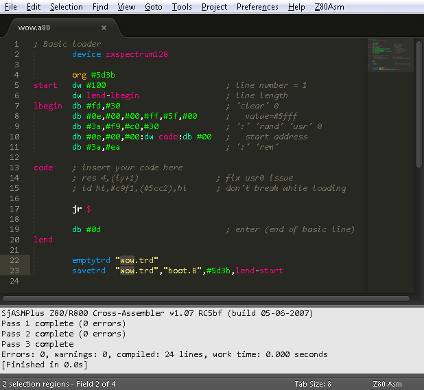

# [Z80 Asm plugin for Sublime Text 2/3](https://github.com/psbhlw/sublime-text-z80asm)
---

## Product Info

This plugin contains syntax definition for Z80 assembler language, code snippets (mostly for ZX-Spectrum), its own shiny color theme. Building system is mainly oriented on [SjASMPlus](http://sourceforge.net/projects/sjasmplus/) assembler and [Unreal Speccy](http://dlcorp.nedopc.com/viewforum.php?f=27) emulator. But of course you can use your own tools with a little fixes to configs.

---

## Installation and configuration

1. Copy the `z80asm` directory to the Sublime Text `Packages` directory. Installation is complete.
2. (Optional, see below) Go to the `Z80Asm > Settings > Build script...` menu and specify a path to your sjasmplus binary. You also can add your own arguments to sjasmplus.
3. (Optional, see below) Go to the `Z80Asm > Settings > Emul script...` menu and specify a path to your UnrealSpeccy binary. You also can modify the way the emulator starts.
4. Go to the `Tools > Build System` menu and select the `z80asm` item.

---

## Features

#### Color scheme

This plugin contains its own color scheme `z80asm.tmTheme` based on Monokai theme. There are some `*.asm` scope selectors with specific colors for assembler tokens. You can tune it on your own taste or integrate it into any other theme. If you don't want any special theme for Z80 Asm - go to the `Z80Asm > Settings > Main settings...` menu and comment the `"color_scheme": "Packages/z80asm/z80asm.tmTheme",` line out.

#### Build system

Sublime Text build system is defined in the `z80asm.sublime-build` file (`Z80Asm > Settings > Build settings...`). This definition file will run an appropriate script for Windows/Linux/OSX system. It also defines `Run` and `Build and Run` actions.

You can specify a path to assembler by `Z80Asm > Settings > Build script...` menu. The included script (`Z80Asm > Settings > Build script...`) performs a search for a `make.bat`/`make.sh` script in the project folder. If the script is found, it will be called (in this case you don't have to specify a path to assembler), otherwise assembler will run against the current file. Included script also removes the `.out` file which is often redundant. If you need this file - comment out the removal.

#### Emulator support

You can specify a path to emulator by `Z80Asm > Settings > Emul script...` menu. The included script attempts to do a search for an `emul.bat`/`emul.sh` script in the project folder. If the script is found, it will be called (in this case you don't have to specify a path to emulator), otherwise the emulator will run with `%asm_name%.sna` parameter or, if `.sna` is absent, with `.spg`/`.trd`/`.scl`/`.tap` parameters. So, to make things work, you must put the `emul.bat` or `emul.sh` script into the project folder, or your source file must create .sna/.spg/.trd/.scl/.tap with the same base name (hello.a80 -> hello.sna).

#### Snippets

There are a lot of useful snippets for ZX-Spectrum, you can trigger them by typing their name and pressing Tab:

* !basic         - Basic monoloader skeleton
* !basexit       - Restore regs and return to Basic  
* !init          - Skeleton for assembler
* !im2           - Init IM 2 interrupt (create table)
* !interr        - Interrupt routine
* !bank          - Switch bank (#7ffd)
* !loop_bc       - BC loop
* !loop_djnz     - DJNZ loop
* !m128          - Memory 48k/128k test
* !pp            - PUSH/POP pair
* !savesp        - Save and restore SP
* !shutay        - Shut up AY-Chip
* !loadsec       - Load sectors (TR-DOS, #3d13)
* !border        - Set border color
* !cls           - Clear screen
* !clsa          - Clear screen attributes
* !clsr          - Clear screen (reverse direction)
* !down          - Calc address of next screen line
* !downs         - Calc address of next screen line (subroutine)
* !up            - Calc address of prev screen line
* !ups           - Calc address of prev screen line (subroutine)
* !fontaddr      - Find character in font (8x8)
* !fontpr        - Print character
* !spr           - Print sprite
* !waitany       - Wait any key
* !waitnokey     - Wait all keys unpressed
* !waitenter     - Wait Enter key
* !waitspace     - Wait Space Key
* !macro         - Macro definition
* !module        - Module definition
* !struct        - Structure definition

#### Auto completion and Goto Symbol

This plugin expands the auto completion feature to all opened tabs (instead of just current file). You can disable it in the settings (`Z80Asm > Settings > Main settings...`).

You can use `Goto > Goto Symbol...` option to jump to the label definition. In Sublime Text 3 you also can use `Goto > Goto Symbol in Project...` to navigate through labels in the whole project.

#### Help files

In the `Z80Asm > Help` sub-menu you can find a few help files. Some of them are provided with the plugin, and you also can put your help file into `Packages/z80asm/helps/`, and it will appear in menu. There are maximum 10 files allowed.

Also, you can call a quick help panel by pressing F1 where you can do a search through opcodes/mnemonics/timings.

---

## Support

If you have a bug/feature request - please post it on [issue tracker](https://github.com/psbhlw/sublime-text-z80asm/issues).

---

## Thanks

* breeze
* introspec
* key-jee
* elf/2
* Sean Young

---

## Copyright and license

(c) 2013, psb^hlw.

Software is distributed on an "AS IS" BASIS, WITHOUT WARRANTIES OR CONDITIONS OF ANY KIND, either express or implied.
